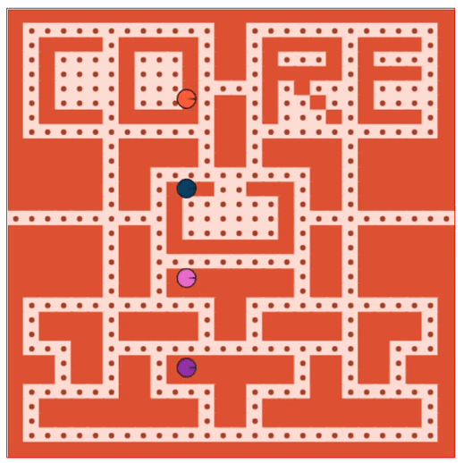

<a href="https://www.coreof.tech/" target="_blank">
  
</a>

# Exercises W5D1 - NodeJS

## 1. Ey! You! Katas!

¡It´s Kata-Time!


- [Too Big To Sum?](https://www.codewars.com/kata/5716afffb436cf11b7001937/train/javascript)

## 2. GitHub Pages

Despliega tu Pacman en producción mediante GitHub Pages. Aprovecha la ocasión para:

- Dibuja 4 Pacmans cada uno de un color diferente.
- COMO EXTRA:
  - Personaliza los elementos que conforman tu mapa (retángulos, círculos, etc) con tu propia gama de colores. Sigue las guías que encontrarás en [schemecolor](https://www.schemecolor.com/).
  - Modifica el mapa para que se muestre un mensaje por pantalla: puede ser tu nombre, un apodo, una idea... ¡Observa el ejemplo de CORE y sorpréndenos!



## 3. NodeJS

Prepara el ordenador para el próximo módulo e instala [node.js](https://nodejs.org/es/download/) en tu equipo.

## 4. Entrega

1. Haz copy&paste del `enlace` con tu solución de kata en el siguiente espacio:

```bash

```

2. Comparte la URL de tu `Pacman en producción` en el siguiente espacio:

```bash

```
